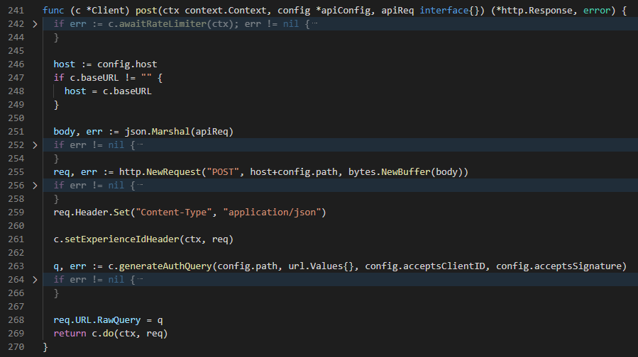

# Hide Error Cases (for Go)

When you read Go codes, you may want to consentrate on normal cases rather than error cases.
This extension may help you in such situation, by folding error case codes or/and making error case codes transparent.

## Features

### Fold Error Cases

`Ctrl+Shift+P` and find & execute "Fold Error Cases" command, then error case codes in .go file opended in current editor will be folded.
To unfold error case codes, `Ctrl+Shift+P` and execute "Unfold All" command (built-in command of VSCode).
You can automatically fold error case codes everytime you open .go files by configuring `go.hideErrorCases.autoFold` (`Extensions` > `Hide Error Cases (Go)` > `Auto Fold` on Settings UI).

### Make Error Cases Transparent

`Ctrl+Shift+P` and find & execute "Make Error Cases Transparent" command, then error case codes in .go file opended in current editor will be transparent.
You can automatically make error case codes transparent everytime you open .go files by configuring `go.hideErrorCases.autoMakeTransparent` (`Extensions` > `Hide Error Cases (Go)` > `Auto Make Transparent` on Settings UI).

## Requirements

- `go` command is available on `PATH`.
- `go` language extension is installed in VSCode.

## Extension Settings

This extension contributes the following settings:

- `go.hideErrorCases.autoFold`: enable/disable auto-fold feature
- `go.hideErrorCases.autoMakeTransparent`: enable/disable auto-make-transparent feature
- `go.hideErrorCases.errorCasesOpacity`: configures opacity of error case codes

### 1.0.0

Initial release of Hide Error Cases
